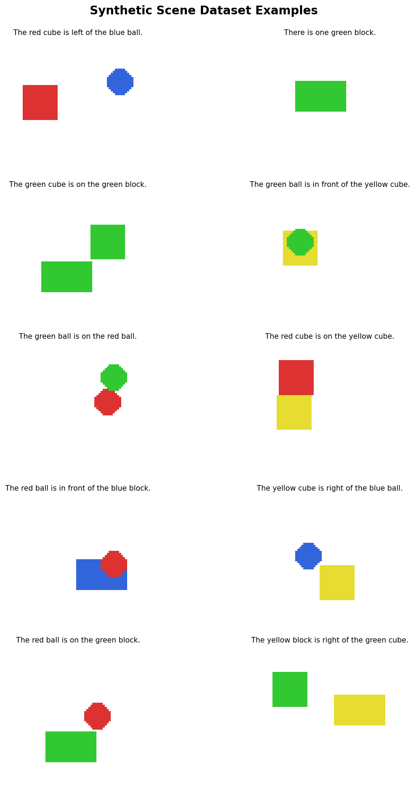

# Learning to See: Vision-Language Learning on Synthetic Scenes

A complete pipeline for vision-language learning using synthetic scenes with compositional generalization testing.

## Overview

This project implements a full vision-language learning system:

1. **Scene DSL**: Fixed vocabulary (32 tokens) with deterministic text ↔ scene graph conversion
2. **Renderer**: Procedural rendering of 64×64 RGB images with spatial relations
3. **Data Generation**: Balanced sampling with compositional splits
4. **Captioner**: ConvNeXt-Tiny + GRU with FSM-constrained decoding
5. **Evaluation**: Comprehensive metrics including compositional generalization tests

## Features

- ✅ **Deterministic Grammar**: EBNF-based DSL with FSM for constrained decoding
- ✅ **Compositional Splits**: Test generalization on unseen color-shape and relation combinations
- ✅ **Spatial Relations**: `left_of`, `right_of`, `on`, `in_front_of` with physical realism
- ✅ **Modern Architecture**: ConvNeXt encoder + attention GRU decoder
- ✅ **Robust Training**: AMP, AdamW, OneCycleLR, scheduled sampling, comprehensive augmentations
- ✅ **Complete Testing**: 40+ unit tests covering all components

## Quick Start (Google Colab)

[](https://colab.research.google.com/github/jtooates/learning_to_see/blob/main/train_captioner.ipynb)

```python
# In Colab, run this cell:
!git clone https://github.com/jtooates/learning_to_see.git
%cd learning_to_see
!pip install -r requirements.txt
```

Then open and run `train_captioner.ipynb` - it includes:
- Interactive data visualization
- Training with real-time metrics
- Attention visualization
- Error analysis
- Compositional generalization testing

## Local Installation

```bash
git clone https://github.com/jtooates/learning_to_see.git
cd learning_to_see
pip install -r requirements.txt
```

## Usage

### Generate Data

```bash
# Random split (IID) - generates 6000 samples, split 80/10/10 train/val/test
python -m data.gen \
    --out_dir ./data/scenes \
    --n 6000 \
    --split_strategy random \
    --seed 42

# Compositional splits
python -m data.gen \
    --out_dir ./data/scenes_color_holdout \
    --n 6000 \
    --split_strategy color_shape \
    --seed 42
```

### Train Captioner

```python
from captioner import train_captioner
from data.dataset import create_dataloaders
from dsl.tokens import Vocab

# Load data
vocab = Vocab()
train_loader, val_loader = create_dataloaders(
    data_dir='./data/scenes',
    vocab=vocab,
    batch_size=128,
    num_workers=4
)

# Train
trainer = train_captioner(
    train_loader=train_loader,
    val_loader=val_loader,
    vocab=vocab,
    device='cuda',
    lr=3e-4,
    max_epochs=50,
    use_amp=True,
    checkpoint_dir='./checkpoints'
)
```

### Evaluate

```python
from captioner import build_captioner, evaluate_model
from dsl.tokens import Vocab

# Load model
vocab = Vocab()
model = build_captioner(vocab_size=vocab.vocab_size)
model.load_state_dict(torch.load('checkpoints/best_model.pt')['model_state_dict'])

# Evaluate
metrics = evaluate_model(
    model=model,
    dataloader=val_loader,
    vocab=vocab,
    device='cuda',
    use_constraints=True
)

metrics.print_summary()
```

### Generate Captions

```python
from captioner import greedy_decode
from PIL import Image
import torch
import torchvision.transforms as T

# Load image
image = Image.open('scene.png').convert('RGB')
transform = T.Compose([T.Resize((64, 64)), T.ToTensor()])
image_tensor = transform(image).unsqueeze(0).to('cuda')

# Generate caption
token_ids, captions = greedy_decode(
    model=model,
    images=image_tensor,
    vocab=vocab,
    use_constraints=True
)

print(f"Caption: {captions[0]}")
```

## Project Structure

```
learning_to_see/
├── dsl/                    # Domain-Specific Language
│   ├── tokens.py          # Vocabulary (32 tokens)
│   ├── parser.py          # Text → Scene graph
│   ├── canonicalize.py    # Scene graph → Text
│   ├── fsm.py             # Finite-state machine for constrained decoding
│   └── splits.py          # Compositional split strategies
├── render/                 # Scene Rendering
│   ├── renderer.py        # Procedural rendering (PIL)
│   └── validate.py        # Spatial relation validation
├── data/                   # Data Pipeline
│   ├── gen.py             # Data generation CLI
│   └── dataset.py         # PyTorch Dataset with shard caching
├── captioner/              # Vision Captioner
│   ├── encoder.py         # ConvNeXt-Tiny encoder
│   ├── decoder.py         # GRU decoder with Bahdanau attention
│   ├── model.py           # Full captioner model
│   ├── decode.py          # Constrained greedy/beam search
│   ├── metrics.py         # Evaluation metrics
│   ├── train.py           # Training loop
│   └── augmentations.py   # Data augmentations
├── tests/                  # Unit Tests
│   ├── test_dsl.py        # DSL tests (17 tests)
│   ├── test_renderer.py   # Renderer tests (17 tests)
│   └── test_captioner.py  # Captioner tests (23 tests)
├── train_captioner.ipynb   # Interactive training notebook
├── requirements.txt
└── README.md
```

## Scene DSL Grammar

```ebnf
Sentence    ::= COUNT_SENT | REL_SENT
COUNT_SENT  ::= "There" ("is" | "are") NUMBER COLOR SHAPE PLURAL? "."
REL_SENT    ::= "The" COLOR SHAPE ("is" | "are") RELATION "the" COLOR SHAPE "."
RELATION    ::= "left of" | "right of" | "on" | "in front of"
COLOR       ::= "red" | "green" | "blue" | "yellow"
SHAPE       ::= "ball" | "cube" | "block"
NUMBER      ::= "one" | "two" | "three" | "four" | "five"
```

**Vocabulary**: 32 tokens including `<BOS>`, `<EOS>`, `<PAD>`

## Examples

### Scene Examples

| Image | Caption |
|-------|---------|
|  | Various spatial arrangements |

**Count sentences:**
- "There is one green block."
- "There are two red balls."

**Relation sentences:**
- "The red cube is left of the blue ball."
- "The green ball is on the yellow cube."
- "The red ball is in front of the blue block."

## Model Architecture

### Encoder: ConvNeXt-Tiny
```
Input: 64×64 RGB image
├─ Patch stem (4×4, stride 4) → 16×16×64
├─ Stage 1: 2 ConvNeXt blocks + downsample → 8×8×128
├─ Stage 2: 2 ConvNeXt blocks + downsample → 4×4×256
└─ Stage 3: 4 ConvNeXt blocks → 4×4×256
Output:
  - grid_tokens: 16 × 256 (flattened spatial features)
  - pooled: 256 (global features)
```

### Decoder: GRU + Bahdanau Attention
```
├─ Embedding: vocab_size → 256
├─ Attention: Bahdanau over encoder grid tokens
├─ GRU: input_size=512 (embed+context), hidden=512
└─ Output projection: 512 → vocab_size
```

### Training
- **Optimizer**: AdamW (lr=3e-4, weight_decay=0.01)
- **Scheduler**: OneCycleLR with 5 epoch warmup
- **Regularization**: Label smoothing (0.1), dropout (0.3), drop path (0.1)
- **Sampling**: Scheduled sampling with inverse sigmoid decay
- **Precision**: Automatic Mixed Precision (AMP)
- **Augmentations**: Random crop, flip, rotation, blur, JPEG, noise, cutout

## Evaluation Metrics

- **Exact Match**: Full caption accuracy
- **Token Accuracy**: Token-level accuracy
- **Attribute F1**: Per-attribute F1 scores (color, shape, number)
- **Confusion Matrix**: Token-level confusion analysis

### Compositional Generalization

Test on three splits:
1. **IID (Random)**: Standard train/test split
2. **Color-Shape Holdout**: Unseen color-shape combinations
3. **Relation Holdout**: Unseen spatial relations

## Running Tests

```bash
# Run all tests
pytest tests/ -v

# Run specific test suite
pytest tests/test_dsl.py -v
pytest tests/test_renderer.py -v
pytest tests/test_captioner.py -v

# With coverage
pytest tests/ --cov=. --cov-report=html
```

All 57 tests passing ✓

## Performance

On A100 GPU (50 epochs, 5K training samples):
- **Training time**: ~30-45 minutes
- **Exact match**: ~95%+ on IID test set
- **Compositional generalization**: ~85-90% on holdout splits
- **Inference**: ~100 images/sec with batch size 128

## Citation

If you use this code, please cite:

```bibtex
@misc{learning_to_see,
  title={Learning to See: Vision-Language Learning on Synthetic Scenes},
  author={J. T. Oates},
  year={2024},
  howpublished={\url{https://github.com/jtooates/learning_to_see}}
}
```

## License

MIT License - see LICENSE file for details.

## Acknowledgments

- ConvNeXt architecture inspired by [A ConvNet for the 2020s](https://arxiv.org/abs/2201.03545)
- Attention mechanism based on [Neural Machine Translation by Jointly Learning to Align and Translate](https://arxiv.org/abs/1409.0473)
- Compositional generalization evaluation inspired by SCAN and CLEVR benchmarks
